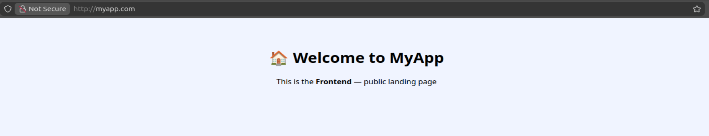
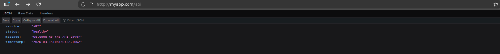

# Kubernetes Ingress Lab

A hands-on project demonstrating Kubernetes Ingress routing 
patterns using NGINX Ingress Controller on Minikube.

## What this covers
- Path-based routing (/api, /admin, /)
- Host-based routing (subdomains)
- defaultBackend catch-all
- ClusterIP Services
- Local Docker image builds inside Minikube

## Tech Stack
- Kubernetes (Minikube)
- NGINX Ingress Controller
- Node.js (http module)
- Docker (node:20-alpine)

## Architecture
```
                    ┌─────────────────┐
                    │  NGINX Ingress  │
                    │   Controller    │
                    └────────┬────────┘
           ┌─────────────────┼─────────────────┐
           ▼                 ▼                 ▼
         /                /api             /admin
   svc-frontend          svc-api          admin-svc
   (port 3000)          (port 8080)       (port 9090)
```

## Live Demo Screenshots

### 🏠 Frontend — myapp.com/


### ⚙️ API — myapp.com/api


### 🔒 Admin — myapp.com/admin


## Ingress Patterns Demonstrated

### 1. Path-based routing
Traffic enters on port 80 and routes based on URL path

### 2. Host-based routing
Each subdomain routes to a different service:
- myapp.local       → frontend
- api.myapp.local   → api service  
- admin.myapp.local → admin service

### 3. defaultBackend
Any unmatched request falls to a catch-all service

## How to run locally

### Prerequisites
- Minikube
- kubectl
- Docker

### Steps

# Start minikube
minikube start

# Enable ingress
minikube addons enable ingress

# Point docker to minikube
eval $(minikube docker-env)

# Build images
docker build -t svc-frontend:v1 ./apps/frontend
docker build -t svc-api:v1      ./apps/api
docker build -t admin-svc:v1    ./apps/admin

# Apply deployments and services
kubectl apply -f k8s/deployments/

# Apply ingress
kubectl apply -f k8s/ingress/01-path-based-ingress.yaml

# Add to /etc/hosts
echo "$(minikube ip) myapp.com" | sudo tee -a /etc/hosts

## ✍️ Lab Questions & Answers

---

### Task 1 — Setup & First Ingress

**Q: What is the name of the IngressClass?**
> `nginx`

**Q: Why are the backend Services ClusterIP and not NodePort?**
> Because the Ingress Controller handles all external traffic, so the backend services only need to be reachable internally. ClusterIP is enough for that.

---

### Task 2 — Path-based Routing

**Q: Why does one Ingress replace 2 NodePort Services?**
> Instead of exposing a separate port for each service, one Ingress handles all traffic on port 80 and routes it to the right service based on the URL path.

---

### Task 3 — Add /admin Path

**Q: What response did /random return?**
> A 404 Not Found — because no rule matches that path.

**Q: How many rules does the routing table show in kubectl describe?**
> 3 rules — one for `/`, one for `/api`, and one for `/admin`.

---

### Task 4 — Host-based Routing

**Q: How many Host entries appear in the describe output?**
> 3 — one for each subdomain.

**Q: What happened with the unknown host (other.myapp.local)?**
> Got a 404 — no rule matched that host so the controller had nowhere to send the request.

**Q: What is the difference between path-based and host-based routing?**
> Path-based routing uses the URL path to decide where to send traffic (e.g. `/api`). Host-based routing uses the subdomain (e.g. `api.myapp.local`). Path-based is for one app with multiple sections, host-based is for completely separate apps.

---

### Task 5 — PathType: Exact vs Prefix

**Q: Did /api/users work?**
> Yes — because the rule uses Prefix, which matches `/api` and anything after it.

**Q: Did /admin/settings work? Why?**
> No — because the rule uses Exact, which only matches `/admin` with nothing after it.

**Q: When would you use pathType: Exact?**
> When you want only that specific path to match and nothing under it — for example `/admin` or `/login`.

---

### Task 6 — Default Backend

**Q: Which service responded to /anything?**
> webapp-svc — it's the defaultBackend, so it catches any request that doesn't match a rule.

**Q: Which service responded to http://myapp.local (no path)?**
> webapp-svc — same reason, no rule matched so it fell back to the defaultBackend.

**Q: What is the real-world use case for defaultBackend?**
> To show a custom 404 page or redirect users when they hit a path that doesn't exist, instead of showing a raw nginx error.

# Test
curl --resolve "myapp.com:80:$(minikube ip)" http://myapp.com
curl --resolve "myapp.com:80:$(minikube ip)" http://myapp.com/api
curl --resolve "myapp.com:80:$(minikube ip)" http://myapp.com/admin

## What I learned
- How Ingress replaces multiple NodePort services
- Difference between path-based and host-based routing
- How pathType Prefix vs Exact affects routing
- How defaultBackend catches unmatched requests
- How Minikube's internal Docker daemon works
- Why service selectors must match pod labels exactly
- Debugging real errors: ErrImageNeverPull, 
  label mismatches, selector immutability
